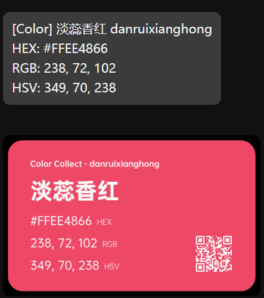

<h1 align="center">FJNU_OJ_Peeper_Bot(Nonebot Branch)</h1>

  <strong>基于PBG项目和官方接口的QQ机器人</strong> 

 

  
  
  
  

# 开始之前：

本分支由 [qwedc001](https://github.com/qwedc001) 维护。请注意，此分支与主项目完全不同，主项目是一个经过配置后可以独立运行的 **官方 QQ 机器人**，而本分支是一个 **Nonebot 机器人**。

这意味着，本分支的代码不会直接运行，而是需要在 **Nonebot** 环境下运行。如果你不了解 **Nonebot**，请先阅读 [Nonebot 文档](https://nonebot.cqp.moe/)。

同时，本分支下的具体代码实现可能会与主项目产生差异。但整体功能追求和主分支大概一致。

本分支的配置主要集中于 src/core/constants.py 下。

分支维护者正在使用 FastAPI 通过反向 WS 以实现 Napcat 与 Nonebot 的通信。通信采用 Onebot V11 标准。

# 功能支持：

注：当前分支支持的内容略少于主分支，仍处于正在适配阶段。标题前有星号的功能为本分支独占。
  
# 全局功能

(简单回应模块)(simple_response.py) /help: 显示所有分支模块的帮助信息。

对于各个分支模块的具体使用方法，使用 /分支功能 来显示当前分支模块的帮助信息。

*(Cron / 定时模块)(cron.py) 每天 0,6,12,18 时会向 Constants.bot_owner 发送心跳信息证明 bot 存活。

# 分支功能 - 算法竞赛

## Codeforces(/codeforces,/cf)(codeforces.py)

支持展示指定用户基本信息和近期提交，列出近期比赛，列出网站上所有赛题 tag 和根据 tag 和难度随机挑选题目用于训练。

## Atcoder(/atcoder,/atc)(atcoder.py)

支持展示指定用户基本信息，列出近期比赛，根据赛题所在比赛类型和难度随机挑选题目用于训练。

## Nowcoder(/nowcoder,/nc,/nk)(nowcoder.py)

支持展示指定用户基本信息与列出近期比赛。

## *Cron / 定时模块 - 算法竞赛(/schedule)(cron.py)

支持通过 platform 和 contestId (Codeforces URL后的数字， Atcoder 的赛事简写如 abc123 ) 订阅特定比赛的通知。管理员用户可以向指定群推送订阅通知。 

# 娱乐功能

## 随机色卡(/color)(pick_color.py)

随机从色卡 json 选取一个颜色，制作并生成对应的色卡。

